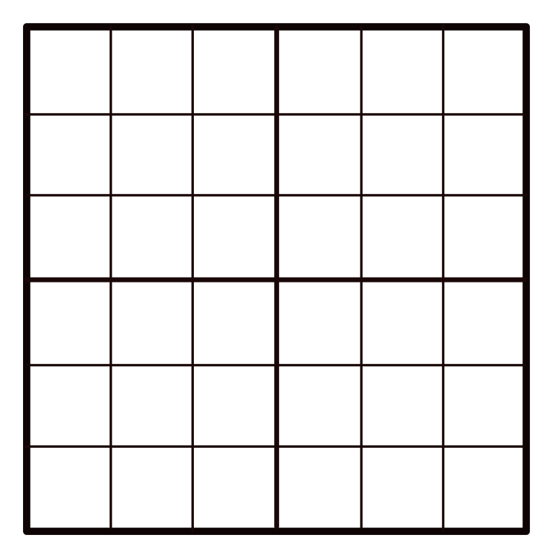

<h1 align="center"> Suduku Algorithm </h1>

 
  <h2> Problem statement: </h2>
    &emsp;- Solve suduku Matrix of dimention 6x6. 
    &emsp;- Each 3x3 submatrix is a Region (or Box). 
  &emsp; 
  
  <h2> Conditions: </h2>
    &emsp;1) Sum of every individual row or column should be 30. 
    &emsp;2) Values of each Region must be unique i.e 1-9. 
  
  <h2>👷‍♂️️ Built with: </h2>
  &emsp;C
  

## 🧒️ Author: 
**Sudharshan Acharya**

-[🤖️ Profile](https://github.com/sudharshanakshay "sudharshan")

<h2 align="center"> 🤝️ Support </h2>

 Any changes are most welcome 🤗️ 
Build with ❤️ in India

